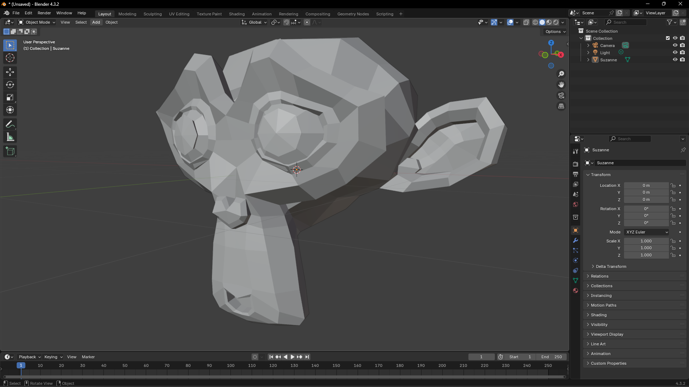

[Home](index.md) | [Manual Assessment Memo](manual_assessment_memo.md) | [Chatbot](chatbot.md) | [Procedure Video](procedure_video.md) | [Manual](manual.md) | [Reflective Blogs](reflective_blogs.md) 

# Procedure Video

Below is a thumbnail of my video. Make sure my website is not open in a pop-up window or frame of another website: common browser security protocols might not allow you to download the video otherwise.
 

 
GitHub still does not support WebM video file embeds, so this will have to do!
  
The Procedure Video contains both Blender 4.3 and GitHub. It was edited in DaVinci Resolve. NVIDIA Broadcast was used to denoise my narration, which is powered by AI.
