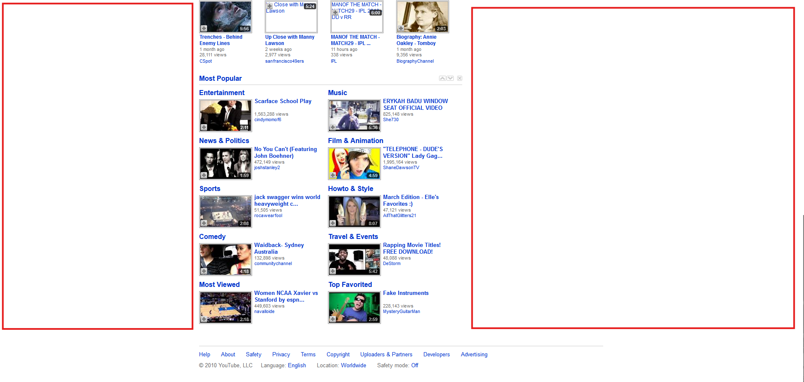
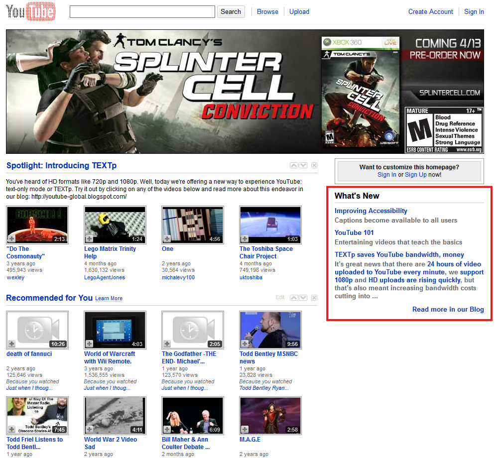
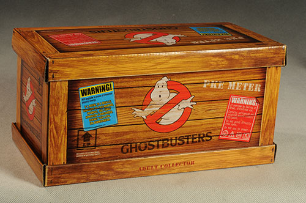
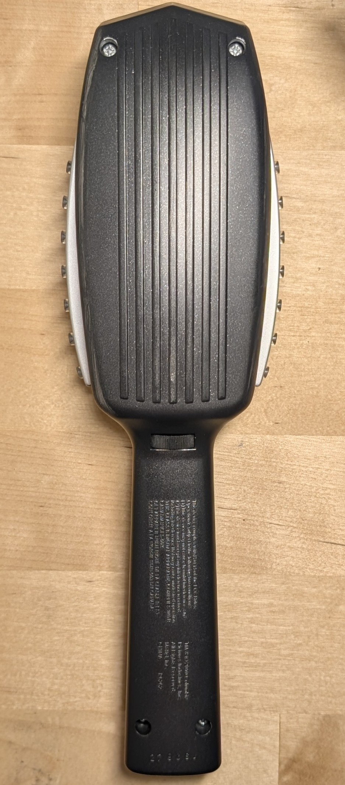
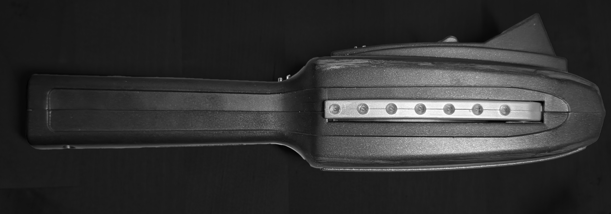
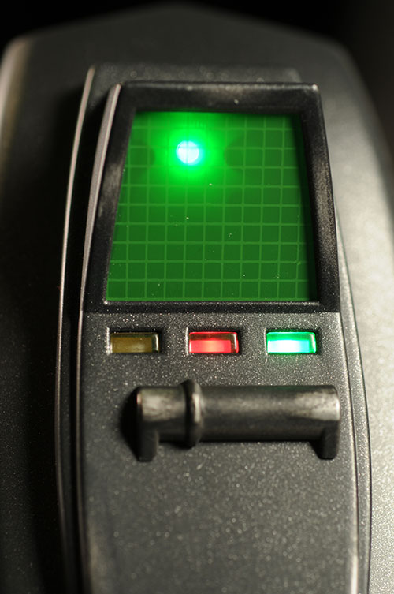

[Home](index.md) | [Manual Assessment Memo](manual_assessment_memo.md) | [Chatbot](chatbot.md) | [Procedure Video](procedure_video.md) | [Manual](manual.md) | [Reflective Blogs](reflective_blogs.md) 

# Reflective Blogs

# Table of Contents 
1. [Wayback Analysis](#wayback-analysis)
2. [Quick Start Guide](#quick-start-guide)
3. [Reflective Blog 3](#reflective-blog-3)

# Wayback Analysis
<a href="https://web.archive.org/web/20100401082612/http://www.youtube.com/">YouTube.com, April 2010.</a>  
# Layout
Although Widescreen formats like 16:9 and 16:10 were available to consumers, 4:3 remained the standard aspect ratio until roughly 2012 to 2013. The webpage's margins, when viewed on a modern display, are quite large, and account for around half of the screen real estate. While present-day websites would likely decrease this significant margin size (the current format has moved pages and tabs to this area) it is likely vertical banner ads would be placed along the borders as well, something which YouTube relegated to a main, horizontal banner ad at the top of the page.
  

  
Most notably, however, is the way that YouTube presents its videos: Several categories are available, from curated content in the Spotlight section, Recommended content from previous searches and watch history, and several topics in the Popular column. This is somewhat similar to the site's current structure, though with much less detailed, much more broad 'genres' present, acting more as a homepage. Where YouTube's current functionality differs vastly, however, is the "infinite scroll" of videos, shorts, community posts, and ads.
  
The platform has pivoted from being a video sharing hub to a form of social media, seeking to engage users for as long as possible. Regardless of any personal opinions about this change, it allows YouTube to make more money on sponsored videos and advertisements, and channels to have a much higher chance of being seen and interacted with, since videos will be populated without a limit.

# Content
At this time, YouTube still maintained and readily linked their official blog posts next to videos, encouraging individuals to create accounts and upload content. They also boast the ability to upload videos in 1080p HD quality, and that 24 hours of content are uploaded every minute, which when compared to current metrics, <a href="https://blog.youtube/press/">shows how much their userbase has increased</a>. Now, YouTube is a part of Google's software conglomerate, and has much different concerns with storage space and video compression than they did a decade ago, but the efforts to avoid running out of server space are still necessary.
  

  
In spite of the space-saving "TEXTp" format mentioned in this particular snapshot of the website being an April Fools joke, it is still notable that YouTube's blog was easily accessible from the website, encouraging users to interact with the site. YouTube's current popularity and longstanding presence means that the blog is less present, reserved for announcements as opposed to community engagement.

# Reflection
To briefly mention the aesthetic of YouTube as a whole, modern web design has pushed the entire platform towards a streamlined, floating user interface, also partially due to Google's expectations of style parity between websites and applications for mobile devices and television. Blue hyperlink text, image borders, and many text styles have been condensed and removed from sites across the internet in favor of consistency and appearance. Usable page space and length have been optimized to better suit new standards for visual and commercial purposes.
  
In those ways, YouTube is like many of the billions of other websites on the internet, publicly-available and ever-evolving to meet both internal and external expectations. 

# Quick Start Guide

## Mattel Ghostbusters Replica PKE Meter
 
Congratulations on becoming the proud owner of your very own psychokinetic energy meter!
  
WARNING: Collector's Toy, Nonfunctional Display Item!

## Requirements:
Phillips Head Screwdriver
 
Three (3) AAA Batteries
 
Scissors/Boxcutter

## 1. Open protective Shipping Box.
Doing so will require the usage of scissors or a boxcutter to remove tape. Inside will be the display box.
## 2. Open decorative Display Box.
Figure 1. 
 
The lid of the box will lift off without any need for a cutting tool.
## 3. Remove packing peanuts.
Dispose of or keep these for display purposes.
## 4. Unwrap PKE meter.
Figure 2. 
 
The plastic film protecting the device is folded over, and will not require a cutting tool.
## 5. Remove Four (4) Phillips Head Screws from the backplate.
Figure 3. 
 
Use caution, the backplate will be completely free once the screws are removed. The screws will stay within the back half of the shell.
## 6. Install Three (3) AAA Batteries in the Handle and Body.
Be mindful of orientation, check your batteries for their positive and negative terminals. 
## 7. Replace outer shell.
Figure 4. 
 
The two halves will be completely flush when aligned properly.
## 8. Replace Four (4) Phillips Head Screws.
Do not overtighten.
## 9. Press any button.
Figure 5. 
 
Press the silver buttons to activate lights and sounds, spin the wheel on the handle to adjust sound speed, and slide the selection bar left and right to change the light pattern.
 
## Your PKE Meter is now ready for action!

# Reflective Blog 3
## Prompt
B: Conduct a usability test on one of your previous assignments for this class (Deliverables or Prompt C). Ask a friend or family member to follow your instructions, and observe them without helping them. You can watch over their shoulder or ask them to screen share on Zoom. If they feel comfortable, ask them to also speak their thoughts as they try to follow your written instructions. What did they struggle to do? What seemed well-explained? What recommendations do you have for yourself moving forward?
 
 
## Response
I had a friend of mine use the PKE meter instructions for a first-time unboxing. Unfortunately I did not have the plastic wrap or original shipping box the item came in, so the first steps regarding unwrapping and unboxing had to be skipped. Since these steps are fairly intutive and the guide mainly focused on the specifics of this particular product, I believe this is still a fair test.
  
The most significant drawback were the pictures I used, and their lack of specificity. I had lent the toy out to a friend for a convention that happened during the assignment, so the few photos that I could find were from other individuals and their reviews, or from inspection when I originally bought the product. This meant that they lacked a tremendous amount of informative value, and my visual guides suffered as a result.
  
This was clear during the test; my friend struggled to understand the concepts of the inner and outer shell, and had to play around with the device to figure out its controls. The latter problem is at least partially excusable, under the guise that it is a toy and meant to be learned through experience, but the setup process was unnecessarily unlcear, and would need to be addressed.
  
My primary feedback was the style of the instructions, and that the GitHub page did not suit their format well. Looking back this could have been resolved by simply uploading a better-designed PDF version of the instructions that had been more customized in their layout, but I wanted to learn more about the capabilities of GitHub pages, and tried to keep them entirely on the website. Had I been able to take more targeted photography to act as more useful visual aids, it is likely I would have been more inclined to refine the design of the instructions as well; those are the two things I would change if I were to rework this document.
  
No tools were used to write or proofread this response, AI or otherwise.
 

<!--# Table of Contents 
1. [Wayback Analysis](#wayback-analysis)
2. [Quick Start Guide](#quick-start-guide)
3. [Reflective Blog 3](#reflective-blog-3)
   
# Wayback Analysis

## Assignment Rationale 

---
# Quick Start Guide

## Assignment Rationale 
This assignment will let you experiment with a generative AI tool of your choice, and you will strengthen your critical thinking skills as you evaluate its strengths and weaknesses.

## Where to Start
Think of a product that you already know how to use. It can be a bluetooth headset, an app, a video game, a sewing machine, or anything that requires a little bit of setup to use.

## Assignment Steps
This assignment is a little more structured than others in our course, so please follow these steps:
1. Open Copilot or any other text-based generative AI tool you prefer (don't pay for it unless you happen to already have a subscription)
2. Write a prompt that asks it to generate a quick-start guide for your product of choice. (copy and paste this somewhere - it is part of what you need to turn in)
3. Evaluate the output. Try to follow the steps yourself, or at least imagine following them.
4. Prompt it again (and again) if needed (again saving your prompts somewhere).
5. Reflect on the process and write a short (200 words) reflection on the tool's strengths, weaknesses, and anything that you learned (or anything that surprised you).

## What is Due
On your portfolio, post the following:
-The name of the tool (with the link if you have it)
-Your prompts
-The best output 
-Your reflection 
---
# Reflective Blog 3
TBD
-->
